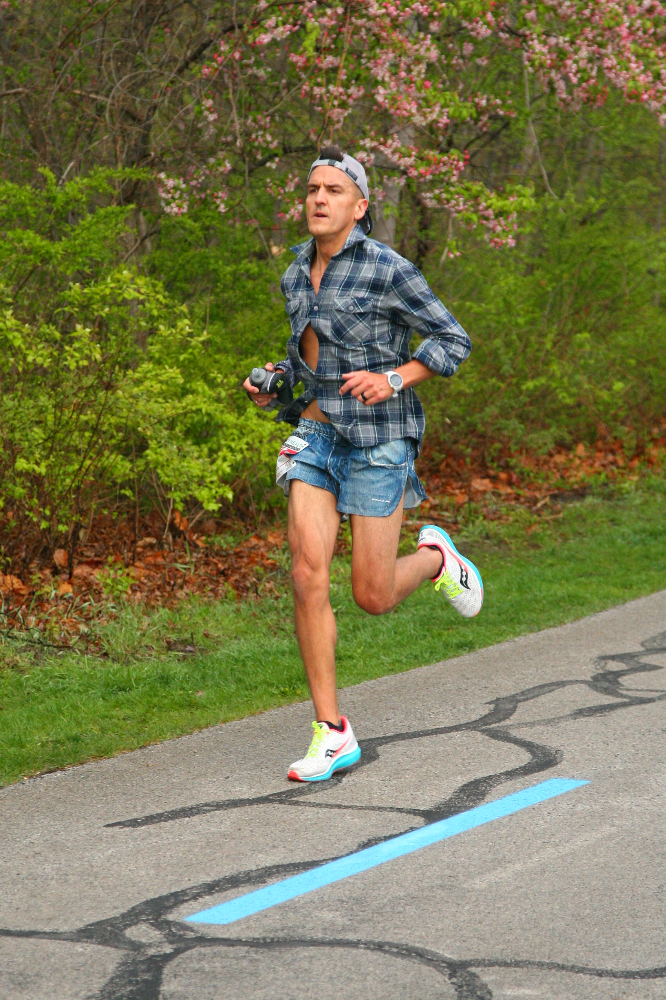
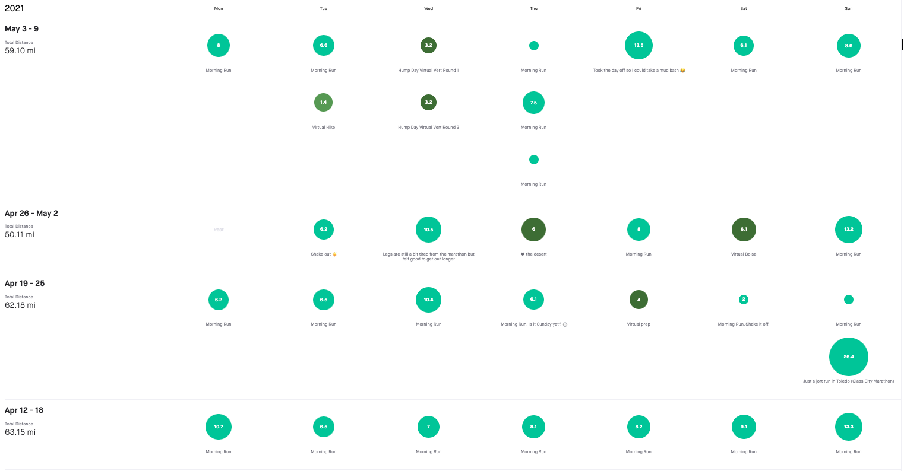
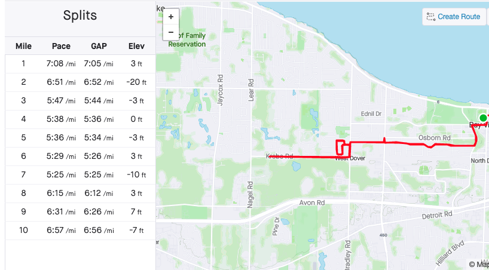
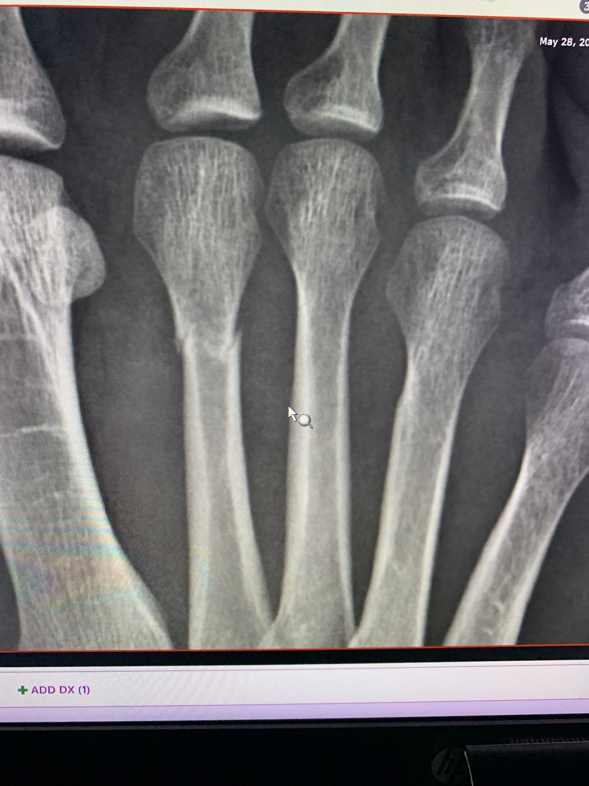

I’m very grateful and very blessed to have had a great spring. I’ve trained with a great crew that helped build me up and helped me run faster than I could have going it alone. It felt good to be the “old man” in the group but still feel as fast and as fit as others a decade+ younger than I am 🤣

This springs’ hard work paid off in Toledo. I went into the marathon lighthearted and with a sense of humor: wearing [jorts](https://www.boausa.com/products/mens-stretch-1-elite-printed-split-run-short-jorts) and a Flannel for the LOL’s. My buddy Matt and our friend Blake did the same and since both Blake and I had strong runs, I’m now convinced that jorts give you a competitive advantage 🤣. (We’ll have to run a few more races to confirm).

Like I mentioned - the hard work and great support paid off. [I PR’d with a time of 2:50:28.91](https://runsignup.com/Race/Results/22766/IndividualResult/LzFZ?resultSetId=250218#U17002798) (26.2 miles at a 6:30 pace). That feels good.

I’d planned on taking a few days off after the Marathon since I’d had so few days off in my training cycle. Instead, I let my mind get the best of my body and I only took 1 day off before I was out there again. 

This was probably my biggest mistake. I’d made it as far as I had with little rest but rest is always needed. 

When we rest we rebuild. 

### Still feeling strong
Skip forward a few weeks:
I’m still feeling strong. I’ve got some minor aches and pains, but I’ve been chocking those up to the usual aches and pains that come with running fast and running far.

I ran an “easier” 10 miler on Wednesday and planned for another 10 miler on Thursday. The crew I run with was planning a tempo run on Thursday so I opted to join them to make my second 10 miles quick. It was. I felt great. I felt strong. It was a great workout and I felt pain free… 

Until the cool down. We began to cool-down around mile 9. That’s when I felt a subtle pain in my right foot. It was sharp, subtle, and nothing I felt like I couldn’t run through. We were cooling down anyway so I saw no reason to let this stop me. I figured I’d massage it out when I got home. 
Each step got worse. 
By the time I made it home, I had to hobble. I assumed tendonitis. I hobbled into the garage, changed out my shoes, and got ready to walk my son to school. The walk to school was slow going and painful… but I pushed through.

After a night of R.I.C.E. an appointment to the doc was in order. This felt worse than tendonitis.

It was. 

My x-ray indicated a "minimally displaced transverse fracture involving the second distal metatarsal shaft". I should have rested 🤦‍♂️

I told my crew what happened as well as some friends and family. I’ve gotten some sympathy and some “oh no! I’m sorry’s”. I’ve appreciated them all - but this is my own doing and a great opportunity to learn. I’m not discouraged. I’m not sad or upset. I’m going to use this as an opportunity and I’m planning to come back stronger.

As I reflected on all of this - it was inevitable given my approach.
I didn’t take enough time to grow and rebuild. I always felt like I was learning from my training cycle, but also needed to allocate some time and energy into growing and rebuilding - not just pushing forward.

In the end, I broke and broke hard. 

### Reflecting on it all
The funny thing is - I was probably always breaking a little. We all are. When we put hard work into something, it takes something out of us. It breaks us just a little. If we’re smart about it, we can break just a little at a time, rest, recover, learn, rebuild, and grow. In doing so, we come out stronger than when we started. Breaking is inevitable. The trick is paying enough attention so that the breaks are small and we’ve granted ourselves enough time to recover, rebuild, and toughen.

**When we don’t listen, don’t pay attention, or don’t grant ourselves the time, the breaks are bigger.**

You can apply this to so much more than running and broken foot bones. We all need to recognize when and how we’re breaking just a little, and we all need to take the time we need to recover and rebuild. 

If we’re smart about it, we rebuild stronger.

I’m optimistic that this experience will teach me a lot and that I’ll come out of this stronger than I was before.  

I’m excited to give one area of my life a bit rest for a while and use the energy I was putting into running into other areas of my life.

I’m looking forward to striking a better balance not  only with my running (once I fully heal), but with so many other things.

This is a blessing in disguise.
